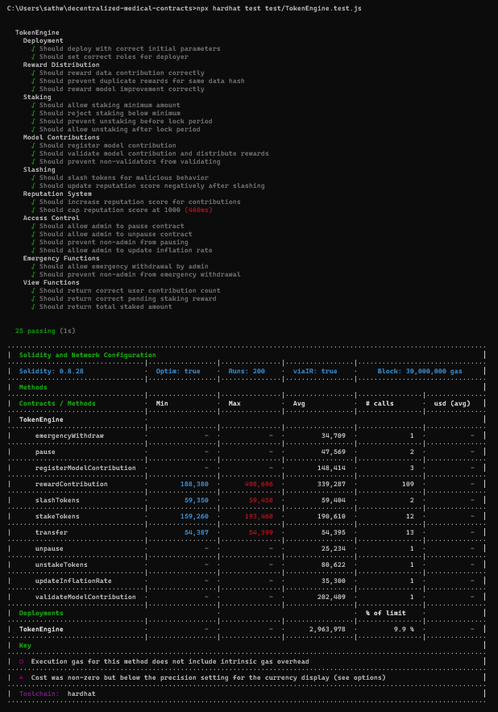

# Decentralized Intelligence: Blockchain-based Deep Learning for Medical Insights

A blockchain-based platform for securely registering, validating, and rewarding contributions of medical data and AI model improvements — powered by smart contracts and token incentives.

## Overview

> 🛠 Built with Hardhat, Solidity, and OpenZeppelin.

---

## Testing

Use Hardhat to run all tests:

```bash
npx hardhat test
```

> `25 passing` test cases covering deployment, rewards, staking, slashing, emergency handling, and access control.

Output Sample Screenshot:
## 

## Installation

1. Clone this repo:

```bash
git clone https://github.com/srikrishna-ps/decentralized-intelligence.git
cd decentralized-intelligence
```

2. Install dependencies:

```bash
npm install
```

3. Compile contracts:

```bash
npx hardhat compile
```

---

## 📜 License

MIT License © 2025
Maintained by \[SriKrishna Pejathaya P S].

---

## Acknowledgements

- [OpenZeppelin](https://openzeppelin.com/contracts/)
- [Hardhat](https://hardhat.org/)
- [IPFS](https://ipfs.tech/)
